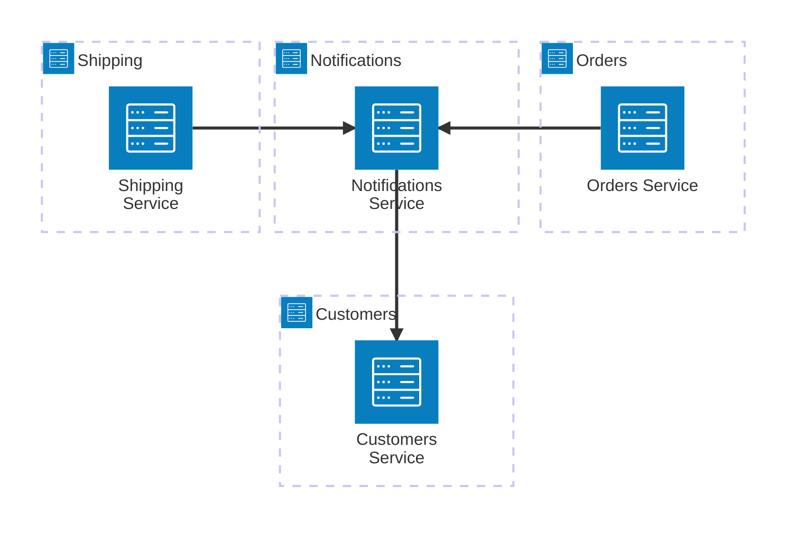

## Microservices
Demonstrates how you can completely extend the default Transmitly behavior by showcasing an notifications service that other services might call. 

### Features
* Communications Client extensibility
* Communication Composition
  * [Resolving Platform Identities](https://github.com/transmitly/transmitly/blob/main/samples/Microservices/Tandely.Notifications.Service/CustomerRepository.cs)    
* Templating
    * Fluid Template Engine
    * Remote Template Loading
    * Embedded Templates
    * Static Templates
* Delivery Strategy Modifier 
* ["From" address resolution](https://github.com/transmitly/transmitly/blob/9a7942313df0fe532e7ad365301b251d964b9e12/samples/Microservices/Tandely.Notifications.Service/Program.cs#L92-L96) (multi-tenant 'from' addresses)
* [Persona filters](https://github.com/transmitly/transmitly/blob/9a7942313df0fe532e7ad365301b251d964b9e12/samples/Microservices/Tandely.Notifications.Service/Program.cs#L84C5-L84C81) - Filter communications based on properties of the identity
* Channel - Available Providers
  * Email - Smtp, Twilio, Infobip, SendGrid
  * Push - Firebase
  * SMS - Twilio, Infobip
  * Logger - All
* Delivery Reports
### Scenario

Tandely is a fictional ecommerce platform that has been setup to use a simple microservice architecture. 
The Orders and Shipping services are responsible for creating new orders and shipping them respectively. 
These services will dispatch a notification event that will be sent to the Notifications service. 
The Notifications service is responsible for composing and dispatching the relevant notifications to Tandely customers.

### Services
* Customers - Manages customer data
* Notifications - Manages dispatching notifications from other services
* Orders - Manages creating new orders
* Shipping - Manages shipping orders

**This sample is not intended to show best practices of microservice architecture. The overall design is kept as simple as possible but could just as easily be extended to a more complex architecture.*
