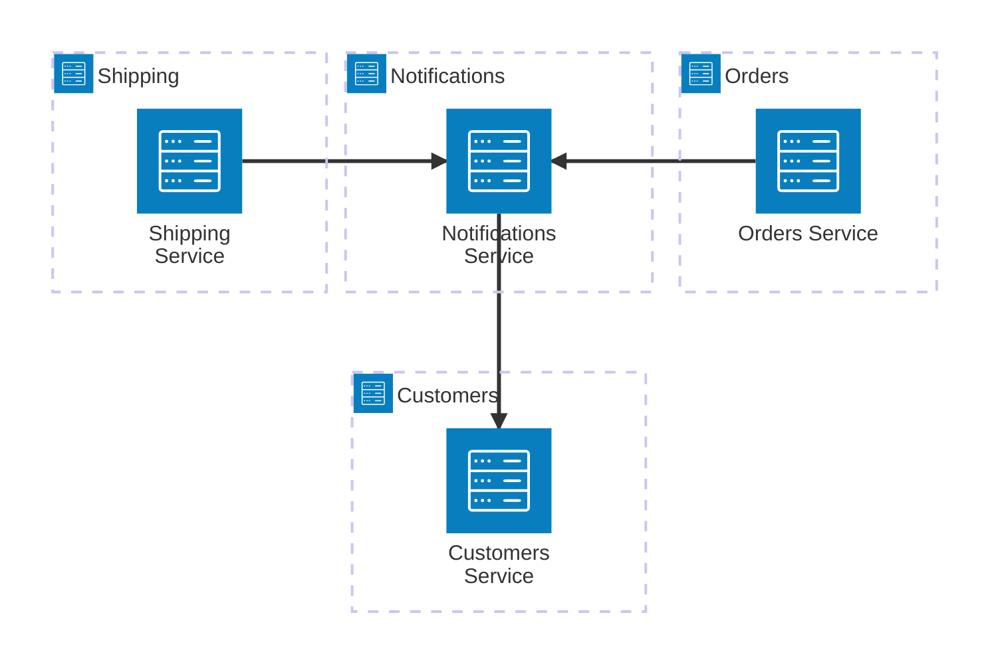

# Samples

This directory contains sample code that demonstrates how to use Transmitly with various channels and channel providers.

## [Kitchen Sink](https://github.com/transmitly/transmitly/tree/main/samples/Transmitly.KitchenSink.AspNetCoreWebApi)
Aims to use as many features of Transmitly as possible. 

Take a look at the [appsettings.json]() for configuration options. If you change nothing, all communications will be logged to the console of the app.

### Features
* Channel - Available Providers
  * Email - Smtp, Twilio, Infobip, SendGrid
  * Push - Firebase
  * SMS - Twilio, Infobip
  * Logger - All
* Channel Delivery Reports
* Template Engine Support - Fluid
* Channel Provider Restrictions 
	* [Restrict channels to a certain channel provider](https://github.com/transmitly/transmitly/blob/694ce5bc2a8ce261a3a52be2518d06835179d2eb/samples/Transmitly.KitchenSink.AspNetCoreWebApi/Program.cs#L157-L161)
* Channel Provider specific functionality
  * Twilio 
	* Get Voice Message Route
	* Delivery Reports - See twilio/messageNeeded
  * SendGrid
	* [Use SendGrid TemplateIds](https://github.com/transmitly/transmitly/blob/694ce5bc2a8ce261a3a52be2518d06835179d2eb/samples/Transmitly.KitchenSink.AspNetCoreWebApi/Program.cs#L155C1-L155C7)

### Routes
* dispatch/otp - Simulates sending a OTP to a user via Email or Push.
* dispatch - Generic dispatch route to allow you to customize dispatching communications.
* channel/provider/update - When exposed publicly can be used with channel providers like Twilio and SendGrid to receive delivery reports.
* twilio/messageNeeded - When exposed publicly can be used with Twilio to provide message content for Voice messages.
  *	Requires [uncommenting code](https://github.com/transmitly/transmitly/blob/694ce5bc2a8ce261a3a52be2518d06835179d2eb/samples/Transmitly.KitchenSink.AspNetCoreWebApi/Program.cs#L182-L187) and the Twilio channel provider to be configured correctly.

## [Microservices](https://github.com/transmitly/transmitly/tree/main/samples/Microservices)
Demonstrates how you can completely extend the default Transmitly behavior by showcasing an notifications service that other services might call. 

### Features
* Communications Client extensibility
* Communication Composition
  * [Resolving Platform Identities](https://github.com/transmitly/transmitly/blob/main/samples/Microservices/Tandely.Notifications.Service/CustomerRepository.cs)    
* Templating
    * Fluid Template Engine
    * Remote Template Loading
    * Embedded Templates
    * Static Templates
* Delivery Strategy Modifier 
* ["From" address resolution](https://github.com/transmitly/transmitly/blob/9a7942313df0fe532e7ad365301b251d964b9e12/samples/Microservices/Tandely.Notifications.Service/Program.cs#L92-L96) (multi-tenant 'from' addresses)
* [Persona filters](https://github.com/transmitly/transmitly/blob/9a7942313df0fe532e7ad365301b251d964b9e12/samples/Microservices/Tandely.Notifications.Service/Program.cs#L84C5-L84C81) - Filter communications based on properties of the identity
* Channel - Available Providers
  * Email - Smtp, Twilio, Infobip, SendGrid
  * Push - Firebase
  * SMS - Twilio, Infobip
  * Logger - All
* Delivery Reports
### Scenario
Tandely is a fictional ecommerce platform that has been setup to use a simple microservice architecture. 
The Orders and Shipping services are responsible for creating new orders and shipping them respectively. 
These services will dispatch a notification event that will be sent to the Notifications service. 
The Notifications service is responsible for composing and dispatching the relevant notifications to Tandely customers.

### Services
* Customers - Manages customer data
* Notifications - Manages dispatching notifications from other services
* Orders - Manages creating new orders
* Shipping - Manages shipping orders

**This sample is not intended to show best practices of microservice architecture. The overall design is kept as simple as possible but could just as easily be extended to a more complex architecture.*
 
## [Transmitly.ChannelProvider.Logger](https://github.com/transmitly/transmitly/tree/main/samples/Transmitly.ChannelProvider.Logger)
An example channel provider that handles all channels. It's only purpose is to log communications dispatched with Transmitly.
